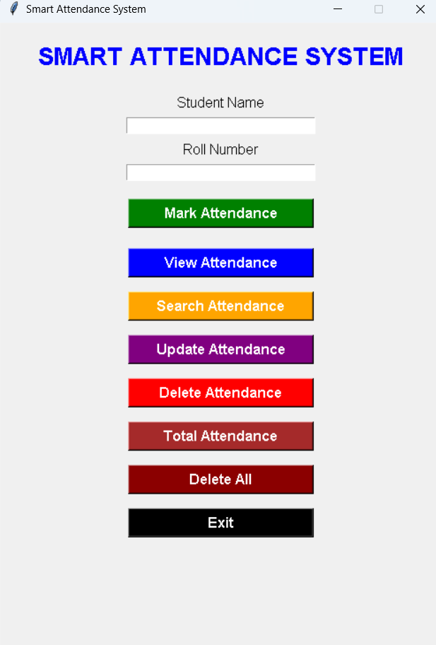

# 📋 Smart Attendance System

<p align="center">


</p>

<p align="center">

## 📚 Smart Attendance Management Desktop Application

**Mark Attendance • View Records • Search • Update • Delete • Track Attendance Easily**

</p>

---

# 📖 Overview

Smart Attendance System is a desktop-based attendance management application developed using **Python** and **Tkinter**. The application provides an easy-to-use graphical interface for recording and managing student attendance.

Attendance records are stored in a **CSV file**, making the application lightweight, fast, and simple to use without requiring any external database.

This project demonstrates Python GUI development, file handling, CRUD operations, and modular programming.

---

# ✨ Features

## ✅ Attendance Management

- Mark Student Attendance
- Prevent Duplicate Attendance (Same Day)
- View All Attendance Records
- Search Attendance by Roll Number
- Update Student Attendance
- Delete Attendance Record
- Delete All Attendance Records
- View Total Attendance Records

---

## 🖥 GUI Features

- User-Friendly Interface
- Tkinter Desktop Application
- Message Boxes
- Attendance Table (Treeview)
- Multiple Windows
- Fixed Window Size
- Simple Navigation

---

# 🛠 Tech Stack

| Technology | Usage |
|------------|-------|
| Python 3 | Programming Language |
| Tkinter | GUI Development |
| CSV | Data Storage |
| datetime | Date & Time |
| os | File Handling |

---

# 📂 Project Structure

```text
Smart-Attendance-System/
│
├── attendance.py          # Backend Logic
├── main.py                # GUI Application
├── attendance.csv         # Attendance Records
├── README.md
```

---

# 🚀 Installation

## 1 Clone Repository

```bash
git clone https://github.com/your-username/Smart-Attendance-System.git
```

---

## 2 Move into Project

```bash
cd Smart-Attendance-System
```

---

## 3 Run Application

```bash
python main.py
```

---

# 📊 Attendance File

The application automatically creates:

```text
attendance.csv
```

Structure:

```csv
Roll,Name,Date,Time
21,Venu,2026-07-30,11:52:55
22,Ravi,2026-07-30,12:05:20
```

---

# 🖼 Application Features

## ✅ Mark Attendance

- Enter Student Name
- Enter Roll Number
- Automatically stores:
  - Current Date
  - Current Time

Duplicate attendance for the same day is automatically prevented.

---

## ✅ View Attendance

Displays all attendance records inside a professional table using **Tkinter Treeview**.

Columns:

- Roll Number
- Student Name
- Date
- Time

---

## ✅ Search Attendance

Search attendance using Roll Number.

Displays:

- Roll Number
- Student Name
- Date
- Time

---

## ✅ Update Attendance

Update existing student information.

Automatically updates:

- Student Name
- Date
- Time

---

## ✅ Delete Attendance

Delete attendance by Roll Number.

---

## ✅ Total Attendance

Displays total attendance records available in the system.

---

## ✅ Delete All

Removes all attendance records after confirmation.

---

## ✅ Exit

Safely exits the application after user confirmation.

---

# 📸 Screenshots

<h2 align="center">🏠 Home Window</h2>

<p align="center">
  
</p>

## Attendance Table

```
-------------------------------------------------------
Roll     Name          Date            Time
-------------------------------------------------------
21       Venu          2026-07-30      11:52:55
22       Ravi          2026-07-30      12:05:20
-------------------------------------------------------
```

---

# 🔄 Application Workflow

```
Start Application
        │
        ▼
Enter Student Details
        │
        ▼
Mark Attendance
        │
        ▼
Save to CSV File
        │
        ▼
View / Search / Update / Delete
        │
        ▼
Exit
```

---

# 📚 Concepts Used

- Python Functions
- Tkinter GUI
- CRUD Operations
- CSV File Handling
- File Management
- Modular Programming
- Loops
- Conditional Statements
- Date & Time Handling
- Exception-Free Input Validation

---

# 🎯 Learning Outcomes

This project demonstrates knowledge of:

- Desktop Application Development
- Python Programming
- GUI Design
- File Handling
- Attendance Management System
- CRUD Operations
- Data Management
- Software Design Basics

---

# 🔮 Future Enhancements

- SQLite Database
- Login Authentication
- Student Photo
- Export to Excel
- Export to PDF
- Dark Mode
- Attendance Percentage
- Monthly Reports
- Search Filters
- Dashboard
- Charts
- Email Notifications
- QR Code Attendance
- Face Recognition Attendance

---

# 💻 How It Works

1. Open Application
2. Enter Student Name
3. Enter Roll Number
4. Click **Mark Attendance**
5. Record is stored in CSV
6. View/Search/Update/Delete records
7. Exit safely

---

# 📈 Project Highlights

- Desktop GUI Application
- Beginner-Friendly
- Lightweight
- No External Database Required
- Easy to Understand
- Modular Code
- Professional CRUD Application

---

# 👨‍💻 Author

**P. Venumohan**

- B.Tech – Computer Science & Data Science
- Python Developer
- Full Stack Developer (Learning)

---

# ⭐ If You Like This Project

If you found this project helpful:

- ⭐ Star the repository
- 🍴 Fork the repository
- 💡 Contribute improvements
- 📢 Share with others

---

# 📄 License

This project is developed for educational and learning purposes.

---

<p align="center">

**⭐ Smart Attendance System ⭐**

**Built with ❤️ using Python & Tkinter**

</p>
